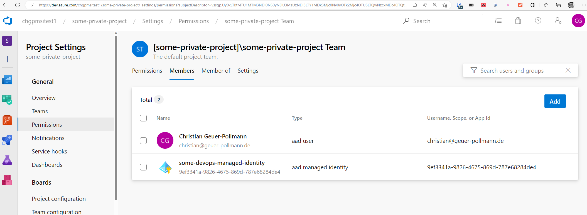
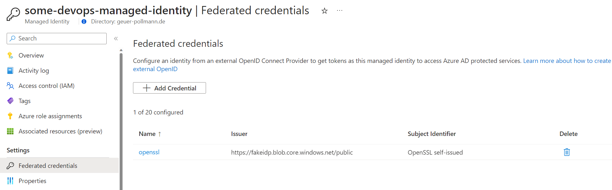

# Sign-in to a user-assigned managed identity to interact with Azure DevOps

## ADO Setup

Created a UAMI and authorized it in Azure DevOps



## Variables

```shell
#!/bin/bash

# Generate an RSA key
private_key_file="key.pem"
public_key_file="key.pub"
key_id="key1"
token_validity_duration="+60 minute"

storage_account="fakeidp"
container_name="public"
issuer_path="https://${storage_account}.blob.core.windows.net/${container_name}"
subject="OpenSSL self-issued"
audience="api://AzureADTokenExchange"

aadTenant="geuer-pollmann.de"
uami_subscription="chgeuer-msdn"
uami_resource_group="longterm"
uami_name="some-devops-managed-identity"
ado_organization="chgpmsitest1"
```

## Setup

```shell
#!/bin/bash

source ./0_vars.sh

openssl genrsa -out "${private_key_file}" 2048
openssl rsa -in "${private_key_file}" -pubout > "${public_key_file}"

jwks_keys="${issuer_path}/jwks_uri/keys"

openid_config_json="$( \
  echo '{"issuer":"","token_endpoint":"","jwks_uri":"","id_token_signing_alg_values_supported":["RS256"],"token_endpoint_auth_methods_supported":["client_secret_post"],"response_modes_supported":["form_post"],"response_types_supported":["id_token"],"scopes_supported":["openid"],"claims_supported":["sub","iss","aud","exp","iat","name"]}' | \
  jq --arg x "${issuer_path}"  '.issuer=$x'         | \
  jq --arg x "${issuer_path}"  '.token_endpoint=$x' | \
  jq --arg x "${jwks_keys}"    '.jwks_uri=$x'       | \
  jq -c -M "."                                      | \
  iconv --from-code=ascii --to-code=utf-8 )"

echo "${openid_config_json}" > openid-configuration.json

az storage blob upload                       \
   --auth-mode login                         \
   --account-name "${storage_account}"       \
   --container-name "${container_name}"      \
   --content-type "application/json"         \
   --file openid-configuration.json          \
   --name ".well-known/openid-configuration"

modulus="$( openssl rsa -in "${private_key_file}" -modulus -pubout -noout | \
      sed 's/Modulus=//' | \
      xxd -r -p | \
      base64 --wrap=0 )"

## If the public exponent is 65537, it is "AQAB" base64-encoded
# You can run the command below to see the exponent:
#
# openssl rsa -in "${private_key_file}" -text -noout | grep publicExponent | sed 's/publicExponent: //'
#
exponent="AQAB"

jwks_keys_json="$( echo "{}"                         | \
  jq --arg x "RSA"             '.keys[0].kty=$x'     | \
  jq --arg x "${issuer_path}"  '.keys[0].issuer=$x'  | \
  jq --arg x "${key_id}"       '.keys[0].kid=$x'     | \
  jq --arg x "${exponent}"     '.keys[0].e=$x'       | \
  jq --arg x "${modulus}"      '.keys[0].n=$x'       | \
  iconv --from-code=ascii --to-code=utf-8 )"

echo "${jwks_keys_json}" | jq . > keys.json

az storage blob upload                       \
   --auth-mode login                         \
   --account-name "${storage_account}"       \
   --container-name "${container_name}"      \
   --content-type "application/json"         \
   --file keys.json                          \
   --name "jwks_uri/keys"

az identity federated-credential create \
   --subscription "${uami_subscription}" \
   --resource-group "${uami_resource_group}" \
   --identity-name "${uami_name}" \
   --name "openssl" \
   --audiences "${audience}" \
   --issuer "${issuer_path}"  \
   --subject "${subject}"

uami_client_id="$( az identity show \
   --subscription "chgeuer-msdn" \
   --resource-group "longterm" \
   --name "some-devops-managed-identity" \
   | jq -r '.clientId' \
   )"

echo -n "${uami_client_id}" > uami_client_id.guid
```

After the setup, we have our fake IdP configured:



## Run

```shell
#!/bin/bash

source ./0_vars.sh

uami_client_id="$( cat "./uami_client_id.guid" )"

function create_base64_url {
    local base64text="$1"
    echo -n "${base64text}" | sed -E s%=+$%% | sed s%\+%-%g | sed -E s%/%_%g 
}

function json_to_base64 {
    local jsonText="$1"
    create_base64_url "$( echo -n "${jsonText}" | base64 --wrap=0 )"
}

# `jq -c -M` gives a condensed/Monochome(no ANSI codes) representation
header="$( echo "{}"                | \
  jq --arg x "JWT"        '.typ=$x' | \
  jq --arg x "RS256"      '.alg=$x' | \
  jq --arg x "${key_id}"  '.kid=$x' | \
  jq -c -M "."                      | \
  iconv --from-code=ascii --to-code=utf-8 )"

payload="$( echo "{}" | \
  jq --arg x "${issuer_path}"                                    '.iss=$x'              | \
  jq --arg x "${audience}"                                       '.aud=$x'              | \
  jq --arg x "${subject}"                                        '.sub=$x'              | \
  jq --arg x "$( date +%s )"                                     '.iat=($x | fromjson)' | \
  jq --arg x "$( date --date="${token_validity_duration}" +%s )" '.exp=($x | fromjson)' | \
  jq -c -M "."                                                                          | \
  iconv --from-code=ascii --to-code=utf-8 )"

toBeSigned="$( echo -n "$( json_to_base64 "${header}" ).$( json_to_base64 "${payload}" )" | iconv --to-code=ascii )"

# RSASSA-PKCS1-v1_5 using SHA-256 
signature="$( echo -n "${toBeSigned}"                         | \
    openssl dgst -sha256 --binary -sign "${private_key_file}" | \
    base64 --wrap=0                                           | \
    sed    s%\+%-%g                                           | \
    sed -E s%/%_%g                                            | \
    sed -E s%=+$%% )"

self_issued_jwt="${toBeSigned}.${signature}"

resource="https://management.azure.com/.default"

azure_devops_appid="499b84ac-1321-427f-aa17-267ca6975798/.default"
resource="${azure_devops_appid}"

token_response="$( curl \
    --silent \
    --request POST \
    --data-urlencode "response_type=token" \
    --data-urlencode "grant_type=client_credentials" \
    --data-urlencode "client_assertion_type=urn:ietf:params:oauth:client-assertion-type:jwt-bearer" \
    --data-urlencode "client_id=${uami_client_id}" \
    --data-urlencode "client_assertion=${self_issued_jwt}" \
    --data-urlencode "scope=${resource}" \
    "https://login.microsoftonline.com/${aadTenant}/oauth2/v2.0/token" )"

access_token="$( echo "${token_response}" | jq -r ".access_token" )"

echo "Self-issued token"
jq -R 'split(".") | .[0],.[1] | @base64d | fromjson' <<< "${self_issued_jwt}"
echo "AAD token"
jq -R 'split(".") | .[0],.[1] | @base64d | fromjson' <<< "${access_token}"

echo "Service response"
curl --silent --get \
   --url "https://dev.azure.com/${ado_organization}/_apis/projects" \
   --header "Authorization: Bearer ${access_token}" \
   | jq .
```

## Output

### Self-issued token

```json
{
  "typ": "JWT",
  "alg": "RS256",
  "kid": "key1"
}
{
  "iss": "https://fakeidp.blob.core.windows.net/public",
  "aud": "api://AzureADTokenExchange",
  "sub": "OpenSSL self-issued",
  "iat": 1682503455,
  "exp": 1682507055
}
```

### AAD token

```json
{
  "typ": "JWT",
  "alg": "RS256",
  "x5t": "-KI3Q9nNR7bRofxmeZoXqbHZGew",
  "kid": "-KI3Q9nNR7bRofxmeZoXqbHZGew"
}
{
  "aud": "499b84ac-1321-427f-aa17-267ca6975798",
  "iss": "https://sts.windows.net/5f9e748d-300b-48f1-85f5-3aa96d6260cb/",
  "iat": 1682503156,
  "nbf": 1682503156,
  "exp": 1682589856,
  "aio": "E2ZgYFjzoyNpn/GNXrbtM9n0H3g1AgA=",
  "appid": "9ef3341a-9826-4675-869d-787e68284de4",
  "appidacr": "2",
  "idp": "https://sts.windows.net/5f9e748d-300b-48f1-85f5-3aa96d6260cb/",
  "oid": "ba98e840-84c6-4df6-908b-e82ab5f714bc",
  "rh": "0.AREAjXSeXwsw8UiF9TqpbWJgy6yEm0khE39CqhcmfKaXV5gRAAA.",
  "sub": "ba98e840-84c6-4df6-908b-e82ab5f714bc",
  "tid": "5f9e748d-300b-48f1-85f5-3aa96d6260cb",
  "uti": "aPVcm-YctUWwmrBKAsQIAA",
  "ver": "1.0"
}
```

### Azure DevOps Service response

```json
{
  "count": 1,
  "value": [
    {
      "id": "d33c7892-cd26-4b0e-b297-96aff303bab6",
      "name": "some-private-project",
      "url": "https://dev.azure.com/chgpmsitest1/_apis/projects/d33c7892-cd26-4b0e-b297-96aff303bab6",
      "state": "wellFormed",
      "revision": 11,
      "visibility": "private",
      "lastUpdateTime": "2023-04-25T13:12:13.383Z"
    }
  ]
}
```

